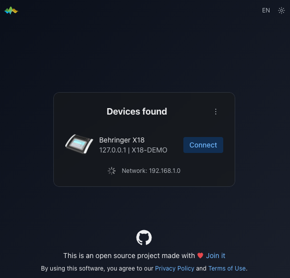

<div align="center">
  
</div>

# Magical Mixing Console

[magicalmixingconsole.com](https://magicalmixingconsole.com)

**Free** and **open source** app for **Behringer X Air** and **M Air** digital mixers.

**Download** from the [releases](https://github.com/matiasbarrios/magical-mixing-console/releases) page.

If looking for a Node.js library for communicating with X Air devices only, check out [magical-mixers](https://github.com/matiasbarrios/magical-mixers).

This software is provided **as-is**, without warranty or support. It communicates with your mixer over the local network; no usage data is collected.

**Trademarks:** Behringer, Midas, X Air, and M Air are trademarks of their respective owners. This project is not affiliated with or endorsed by Music Tribe or Behringer.

Feel free to fork it, build crazy versions, add support to other brands/models, or whatever. If distributing, use your own name/logo for avoiding clashes.

Built with ❤️ by Matías Barrios in Piriápolis, Uruguay 🇺🇾. Aguante la música ✨

## Quick start

### Install dependencies

```bash
git clone https://github.com/matiasbarrios/magical-mixing-console.git
cd magical-mixing-console
npm install
```

Install a couple of Capacitor plugins:

```bash
git clone https://github.com/matiasbarrios/capacitor-udp-socket.git plugins/capacitor-udp-socket
cd plugins/capacitor-udp-socket
npm install
npm run build
cd ../..

git clone https://github.com/matiasbarrios/capacitor-navigation-bar.git plugins/capacitor-navigation-bar
cd plugins/capacitor-navigation-bar
npm install
npm run build
cd ../..
```

### Run a virtual device

If you don't have a real one:

```bash
cd src/virtual-devices
npm run x18
cd ../..
```

### Desktop version

In dev mode:

```bash
npm run electron-dev
```

The app should open showing the following screen:



### Mobile version

Before building for mobile:

1. Set `appId` and `appName` in [`capacitor.config.json`](../../capacitor.config.json) if you fork and publish your own build (defaults use `com.opensource.magicalmixing.console` / `Open-Sourced Magical Mixing Console` so they do not collide with the commercial app).
2. Run `npm run cap-make`.
3. Add native projects: `npx cap add android` and/or `npx cap add ios`.
4. Configure signing in Android Studio / Xcode for your own store accounts.

In dev mode:

```bash
npm run cap-dev
npm run cap-android
npm run cap-ios
```

## Documentation

Full index: **[docs/README.md](docs/README.md)**

| Document | Purpose |
|----------|---------|
| [docs/development/DEVELOPMENT.md](docs/development/DEVELOPMENT.md) | Clone, plugins, npm scripts, iOS/Android dev notes |
| [docs/development/DEBUGGING_NETWORK.md](docs/development/DEBUGGING_NETWORK.md) | Wireshark filters for OSC/UDP |
| [docs/reference/ARCHITECTURE.md](docs/reference/ARCHITECTURE.md) | Layers and where to change code |
| [docs/reference/CONCEPTS.md](docs/reference/CONCEPTS.md) | Mixer domain model |
| [docs/reference/CONNECTIVITY.md](docs/reference/CONNECTIVITY.md) | Device search, sockets, platform UDP |
| [docs/gui/GUI.md](docs/gui/GUI.md) | GUI conventions |
| [docs/gui/LIST_PATTERN.md](docs/gui/LIST_PATTERN.md) | List UI patterns |
| [docs/TESTING.md](docs/TESTING.md) | Automated tests |

## Contributing

Questions and architecture help → [Discussions](https://github.com/matiasbarrios/magical-mixing-console/discussions). Bugs and scoped work → [Issues](https://github.com/matiasbarrios/magical-mixing-console/issues/new/choose).

See **[CONTRIBUTING.md](CONTRIBUTING.md)** for setup, layer guide, tests, and PR notes.

## License

Apache License 2.0 — see [LICENSE](LICENSE).
