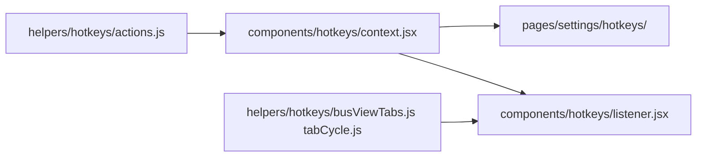

# Hotkeys — guide to implementing keyboard shortcuts

Guide for agents and developers adding configurable keyboard shortcuts in the console. The whole system lives in `src/console/gui/` (do not touch `mixers` or platform code).

---

## How it works

1. **Catalog** — each action has an `id`, i18n label, settings group, and default binding.
2. **Persistence** — users can remap keys; bindings are saved in settings under `hotkeys-bindings` via `HotkeysProvider`.
3. **Listener** — a single `keydown` on `document` (capture), matches bindings and runs handlers; some actions have route guards (e.g. bus view tabs).
4. **Settings UI** — the **Hotkeys** dialog (`pages/settings/hotkeys/`) reads the catalog automatically; no manual rows if the action is in `HOTKEY_ACTIONS`.



---

## File map

| File | Role |
|------|------|
| `helpers/hotkeys/binding.js` | Factory `hotkeyBinding(key, modifiers?)` → serializable object |
| `helpers/hotkeys/platformModifier.js` | `primaryModifier()` → `⌘` on Mac, `Ctrl` on Windows/Linux |
| `helpers/hotkeys/match.js` | `eventMatchesBinding`, `findActionForEvent` (optional filter by action id) |
| `helpers/hotkeys/normalize.js` | Converts captured `KeyboardEvent` → binding (record UI) |
| `helpers/hotkeys/format.js` | Binding → display text (`H`, `⌘P`, …) |
| `helpers/hotkeys/guards.js` | `shouldIgnoreHotkeyEvent`, `resetFocusForHotkeys` (focus reset on navigate) |
| `helpers/hotkeys/actions.js` | **Central registry**: merge of all modules + `HOTKEY_GROUP_ORDER` |
| `helpers/hotkeys/busViewTabs.js` | Bus view tab catalog and activation (`busView.tab.*`, `activateBusViewTabForEvent`) |
| `helpers/hotkeys/tabCycle.js` | Generic tab cycle (`T` / `⇧T`), `registerTabBar` / `getActiveTabBar` |
| `helpers/hotkeys/focusRoam.js` | Cycle focus among marked controls (`focus.next.*` / `focus.prev.*`) |
| `components/hotkeys/context.jsx` | `HotkeysProvider`, `useHotkeys()`, persistence |
| `components/hotkeys/listener.jsx` | **Single** global listener: home, focus roam, tab cycle, bus view tabs |
| `pages/settings/hotkeys/` | Settings dialog and UI |
| `components/global/context.jsx` | Mounts `HotkeysProvider` |
| `components/layout/index.jsx` | Mounts `HotkeyListener` (global) |
| `components/language/translations/*.js` | Action label and group name translations |

**Tests:** `tests/console/gui/helpers/hotkeys/` — Vitest, no DOM unless jsdom is configured.

---

## Binding model

Always use `event.code` (physical key), not `event.key`:

```js
{
  key: 'KeyP',      // KeyboardEvent.code
  ctrlKey: false,
  altKey: false,
  metaKey: true,    // ⌘ on Mac
  shiftKey: false,
}
```

Create defaults with:

```js
import { hotkeyBinding } from './binding';
import { primaryModifier, primaryAltModifier } from './platformModifier';

hotkeyBinding('KeyH');                              // H
hotkeyBinding('KeyP', primaryModifier());          // ⌘P on Mac, Ctrl+P on Windows
hotkeyBinding('KeyP', { ...primaryModifier(), shiftKey: true });
hotkeyBinding('KeyR', primaryAltModifier());        // ⌥⌘R on Mac, Ctrl+Alt+R on Windows
```

Focus roam actions use `primaryModifier()` in `buildFocusBinding` — do not hardcode `metaKey: true` in specs except edge cases.

---

## Checklist: new global action

Reference example: `navigate.home`, `focus.next.pan`.

### 1. Define the action

In a domain module (or directly in `actions.js` if trivial):

```js
// helpers/hotkeys/myModule.js
export const myActionActions = {
  'my.action.id': {
    id: 'my.action.id',
    labelKey: 'My action label',   // i18n key
    groupKey: 'General',           // must exist in HOTKEY_GROUP_ORDER
    defaultBinding: hotkeyBinding('KeyX', { metaKey: true }),
  },
};
```

Import and spread in `helpers/hotkeys/actions.js`:

```js
import { myActionActions } from './myModule';

const HOTKEY_ACTIONS = {
  ...
  ...myActionActions,
};
```

If it is a new group, add it to `HOTKEY_GROUP_ORDER` in the same file.

### 2. Implement the handler

In `components/hotkeys/listener.jsx`:

```js
const ACTION_HANDLERS = {
  ...
  'my.action.id': () => {
    // logic; return false if it could not run (no preventDefault)
    return true;
  },
};
```

`busView.tab.*` actions run in the global listener only on `/bus/:id` routes (via `activateBusViewTabForEvent`); the general matcher **excludes** them with `!isBusViewTabAction`. Other ids match in `ACTION_HANDLERS`.

If the action needs React hooks (`useNavigate`, mixer data), implement the handler in a hook and pass it into the `useEffect` closure, like `navigateHome`.

### 3. Translations

In `components/language/translations/*.js`, add:

- the action `labelKey` (e.g. `'My action label': '…'`).
- the `groupKey` if it is a new group (e.g. `Focus: 'Focus'`).

### 4. Tests

In `tests/console/gui/helpers/hotkeys/`, verify at least:

- default binding in `getDefaultBindings()`;
- match with `findActionForEvent` if logic is non-trivial.

### 5. Settings

No need to touch `pages/settings/hotkeys/content.jsx` — it lists all `HOTKEY_ACTIONS` entries grouped by `groupKey`.

---

## Pattern: bus view tabs

**Catalog file:** `helpers/hotkeys/busViewTabs.js`

Add a row to `BUS_VIEW_TAB_HOTKEYS`:

```js
{ tabId: 'eq', actionId: 'busView.tab.eq', labelKey: 'Equalizer', key: 'KeyE' },
```

- `tabId` must match the tab `id` in `pages/bus/view/index.jsx`.
- Multiple tabs may share the same key if they **never coexist** (e.g. `fx` and `insert` → `KeyF`). `findBusViewTabActionForEvent` only activates **visible** tabs.
- Bus view tabs (and other entity views) register in `EntityTabsShell` via `registerTabBar` (`tabCycle.js`), even when the visible bar is in the header (`hideTabBar` + `useHeaderTrailCenter`).

**Handler:** in `components/hotkeys/listener.jsx`, when the route matches `/bus/:id`, call `activateBusViewTabForEvent(event, bindings)`. That function gets the active tab bar with `getActiveTabBar()` and runs `onChange(tabId)`. Do not add `busView.tab.*` entries to `ACTION_HANDLERS`.

**Id convention:** `busView.tab.<tabId>`.

---

## Pattern: focus roam between controls

Jump to the next/previous control of the same type on screen (e.g. all pans).

### 1. Actions in `helpers/hotkeys/focusRoam.js`

Next/prev pair with the same `roamId`. Targets live in `FOCUS_ROAM_SPECS` (`focusRoam.js`); adding a row there generates catalog, handlers (`buildFocusRoamHandlers()`), and tests.

```js
{
    roamId: 'previewEq',
    key: 'KeyE',
    labelNext: 'Focus next equalizer preview',
    labelPrev: 'Focus previous equalizer preview',
},
```

Reuse `focusRoamControl(roamId, direction)` — finds `[data-focus-roam="<roamId>"]` in the DOM, cycles focus, and calls `scrollIntoView`.

### 2. Handlers in `components/hotkeys/listener.jsx`

```js
const ACTION_HANDLERS = {
    'navigate.home': ({ navigateHome }) => navigateHome(),
    ...buildFocusRoamHandlers(),
};
```

### 3. Mark controls in the UI

On the focusable component (or domain control wrapper):

```jsx
<Knob focusRoam="pan" ... />
// → data-focus-roam="pan" on the node with tabIndex

<MeterSlider ... />
// → data-focus-roam="slider" on the thumb by default (focusRoam prop, disable with false)

<MiniPreviewContainer focusRoam="previewEq" ... />
<LetterIconButton focusRoam="solo" ... />
<Button data-focus-roam="busIdentifier" ... />
```

Only mark the control type that should participate (not every knob). References: pan (`pan.jsx`), sliders (`meterSlider.jsx`), reception previews (`fromTo/from/*.jsx`), solo/mute (`solo.jsx`, `mute.jsx`), bus identifier (`openFrom.jsx` → `SourceViewBus`).

### Registered focus roam shortcuts

| Key | roamId | Control |
|-----|--------|---------|
| `⌘P` / `⇧⌘P` | `pan` | Pan knob |
| `⌘L` / `⇧⌘L` | `slider` | MeterSlider |
| `⌘E` / `⇧⌘E` | `previewEq` | EQ mini preview |
| `⌘C` / `⇧⌘C` | `previewCompressor` | Compressor mini preview |
| `⌘G` / `⇧⌘G` | `previewGate` | Gate mini preview |
| `⌘I` / `⇧⌘I` | `inputPreview` | Input button (reception) |
| `⌘S` / `⇧⌘S` | `solo` | Solo button |
| `⌘M` / `⇧⌘M` | `mute` | Mute button |
| `⌘B` / `⇧⌘B` | `busIdentifier` | Ghost with bus type/number |
| `⌥⌘R` | `reset` | Reset button |
| `⌥⌘A` | `add` | Add button |
| `⌥⌘E` / `⇧⌥⌘E` | `edit` | Edit button |
| `T` / `⇧T` | — | Next / previous tab (any tabbed view) |

With focus on a preview button, **Space** opens the dialog (native button behavior).

Tabs register automatically in `EntityTabsShell` via `registerTabBar` (`tabCycle.js`). In entity views the visible bar is in the header (`HeaderTabBar` + `useHeaderTrailCenter`), not inline on the page.

---

## Pattern: scoped local listener

Optional when the shortcut **should only exist** on one mounted screen or context:

1. Define actions in the catalog (for settings).
2. Create `myListener.jsx` using `useHotkeys()` + `findActionForEvent` with a filter.
3. Mount the component only where it applies.

The global listener must **exclude** those ids if they must not run outside the scope.

**Note:** bus view tabs **no longer** use this pattern. They are handled in the global listener with a route guard (`BUS_VIEW_PATH`) and `activateBusViewTabForEvent`; the general matcher excludes `busView.tab.*` via `!isBusViewTabAction`.

---

## Existing wiring (do not duplicate)

| Provider / listener | Where it mounts |
|---------------------|-----------------|
| `HotkeysProvider` | `components/global/context.jsx` |
| `HotkeyListener` (global) | `components/layout/index.jsx` |

---

## Conventions

| Topic | Rule |
|-------|------|
| Action ids | `domain.verb.object` — e.g. `navigate.home`, `busView.tab.input`, `focus.next.pan` |
| Key | `event.code` (`KeyH`, `Digit1`, `ArrowLeft`, …) |
| Text inputs | Guards skip shortcuts when focus is in `INPUT` / `TEXTAREA` / `contentEditable` |
| Record shortcut | `data-hotkey-recording` in `hotkeyInput.jsx`; the guard respects it |
| Handler return | `false` → no `preventDefault` (e.g. no focus roam targets) |
| macOS / Electron | Reset/add/edit use `primaryAltModifier()` (`⌥⌘` / `Ctrl+Alt`). EQ preview stays on `primaryModifier()+E` |
| Windows | Focus roam uses **Ctrl**, not the Windows key (`metaKey`). See `platformModifier.js` |
| GUI scope | Only `src/console/gui/**` |

---

## Examples in the repo

| Action | Type | Key files |
|--------|------|-----------|
| Go to Home (`H`) | Global | `actions.js`, `listener.jsx`, `useNavigateHome.js` |
| Bus view tab (`I`, `S`, `E`, …) | Route `/bus/:id` | `busViewTabs.js`, `tabCycle.js`, `listener.jsx` |
| Next/previous pan (`⌘P` / `⇧⌘P`) | Focus roam | `focusRoam.js`, `listener.jsx`, `pan.jsx`, `knob.jsx` |
| Next/previous slider (`⌘L` / `⇧⌘L`) | Focus roam | `focusRoam.js`, `listener.jsx`, `meterSlider.jsx` |
| Previews / input / solo / mute / bus id (`⌘E`…`⌘B`) | Focus roam | `focusRoam.js`, `fromTo/from/*.jsx`, `solo.jsx`, `mute.jsx`, `openFrom.jsx` |
| Reset / add / edit (`⌥⌘R`, `⌥⌘A`, `⌥⌘E`) | Focus roam | `focusRoam.js`, list toolbars, `editButton.jsx` |
| Next / previous tab (`T` / `⇧T`) | Tab cycle | `tabCycle.js`, `entity/tabs.jsx`, `listener.jsx` |

---

## Related docs

- [GUI.md](../gui/GUI.md) — UI conventions
- [DEVELOPMENT.md](./DEVELOPMENT.md) — setup and repo structure
- [ARCHITECTURE.md](../reference/ARCHITECTURE.md) — project layers
