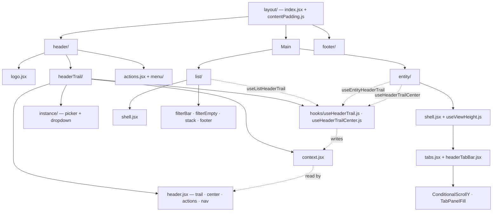

# Console GUI — Layout

Map of **layout components and page shells** in `src/console/gui/`. For list row anatomy and filters see [LIST_PATTERN.md](./LIST_PATTERN.md). For subscription rules see [GUI.md](./GUI.md). For entities and routes see [CONCEPTS.md](../reference/CONCEPTS.md).

---

## Mental model

Every screen sits inside the same app shell. What changes is the **page type** (list, entity view, or exception) and how it registers the **header trail** (what the sticky header shows for the current route).

```
┌─────────────────────────────────────────────────────────────┐
│ Header (sticky)                                             │
│  Logo │ Header trail (label or instance picker) │ actions   │
├─────────────────────────────────────────────────────────────┤
│ Main (scrollable, padded)                                   │
│                                                             │
│   ┌─ page content ─────────────────────────────────────┐  │
│   │  list shell  OR  entity view shell  OR  exception   │  │
│   └────────────────────────────────────────────────────┘  │
│                                                             │
├─────────────────────────────────────────────────────────────┤
│ Footer (sticky, conditional) — MG / Solo / page action    │
└─────────────────────────────────────────────────────────────┘
```

Folder hierarchy and how page types register the header trail:



| Layer | Location | Responsibility |
|-------|----------|----------------|
| App shell | `components/layout/` | Viewport column, header, scroll area, footer |
| Header trail | `components/layout/headerTrail/` | What the header shows for the current route |
| List kit | `components/layout/list/` | Filter bar, row stack, list footer, empty state |
| Entity view kit | `components/layout/entity/` | Full-height detail views with tabs |
| Form rows | `components/base/labelControlTable.jsx` | Label + control pairs (settings, parameters) |
| Page code | `pages/<entity>/` | Wires the kits together for each route |

---

## Header trail

**Not** a mixer entity. **Not** a page tab. The **header trail** is the single label (or instance picker) the sticky header shows for the current screen.

| Screen | Hook | What appears in the header |
|--------|------|----------------------------|
| List (`/input/list`) | `useListHeaderTrail(t('Inputs'))` | Entity name only: "Inputs" |
| Detail (`/input/3`) | `useEntityHeaderTrail({ instance, previous, next, actions })` | Instance picker or static name + prev/next + actions |
| Settings | `useEntityHeaderTrail({ entity, instance })` | "Settings" + device name |

Pages do not render the trail in their JSX. They call a hook → hook writes `HeaderTrailProvider` → `Header` reads it and renders `HeaderTrail`, `HeaderTrailActions`, `HeaderTrailNavigation`.

**Registration examples:**

```js
// List page
useListHeaderTrail(t('Inputs'));

// Entity view — instance picker + navigation
useEntityHeaderTrail({
    instance: { inputId: input.id },
    previous: '/input/2',
    next: '/input/4',
    actions: <HeaderIconButton … />,
});

// Settings — entity + static instance label
const entity = useMemo(() => ({ name: t('Settings') }), [t]);
const instance = useMemo(() => ({ name: deviceName }), [deviceName]);
useEntityHeaderTrail({ entity, instance });
```

### Header trail API

| Export | File | Role |
|--------|------|------|
| `HeaderTrailProvider` | `headerTrail/context.jsx` | Provider (mounted in `Layout`) |
| `useHeaderTrail` | `headerTrail/header.jsx` | Low-level read/write `{ entity, instance, actions, previous, next }` |
| `HeaderTrail` | `headerTrail/header.jsx` | Renders entity label + instance area |
| `HeaderTrailActions` | `headerTrail/header.jsx` | Renders trail actions (e.g. edit pencil) |
| `HeaderTrailNavigation` | `headerTrail/header.jsx` | Prev/next chevrons |
| `HeaderTrailCenter` | `headerTrail/header.jsx` | Center slot (entity view tab bar) |
| `useListHeaderTrail` | `headerTrail/hooks/useHeaderTrail.js` | List routes |
| `useEntityHeaderTrail` | `headerTrail/hooks/useHeaderTrail.js` | Entity views, settings |
| `useHeaderTrailCenter` | `headerTrail/hooks/useHeaderTrailCenter.js` | Register tab bar in header center |

### Header instance pickers

When `headerTrail.instance` carries an entity id (`busId`, `inputId`, …), the header renders an **instance picker** dropdown instead of plain text.

| Layer | File | Role |
|-------|------|------|
| Layout | `headerTrail/instance/picker.jsx` | Dispatches `instance.*Id` → entity picker |
| Layout | `headerTrail/instance/dropdown.jsx` | Shared trigger wrapper (ghost button or static label) |
| Pages | `pages/<entity>/view/sectionInstance.jsx` | Entity menu, labels, navigation (next to `open*.jsx`, `name.jsx`) |

Entities with a picker: bus, input, fx, dca, mg, scene, output, vault.

---

## App shell (`components/layout/`)

### `index.jsx` — root `Layout`

Wraps every normal route (see `components/global/index.jsx`). Provides:

- `HeaderTrailProvider` — header trail state
- `FooterProvider` — bottom bar state
- **Header** — sticky top bar
- **Main** — `ScrollArea` with `layoutPaddingX` / `layoutPaddingY` from `contentPadding.js`
- **Footer** — sticky bottom bar

Routes that opt out of the shell (`noHeader`) render children directly (e.g. device connect during onboarding).

### `contentPadding.js`

Shared inset for scrollable main content:

| Export | Value | Used by |
|--------|-------|---------|
| `layoutPaddingX` | `'4'` | `Layout` main `Flex` |
| `layoutPaddingY` | `'4'` | `Layout` main `Flex` |
| `layoutPaddingYPx` | `calc(var(--space-4) * 2)` | `entity/useViewHeight.js` (top + bottom padding) |

### `header/`

Sticky 48px bar (`headerHeight`). Left: logo + header trail. Center: device status (paused / reconnecting). Right: wizard trigger, trail actions, prev/next navigation, app menu.

`Header` accepts `fixed` for full-screen flows outside `Layout` (e.g. `pages/device/connect.jsx`).

| File | Role |
|------|------|
| `header/index.jsx` | Sticky bar composition |
| `header/actions.jsx` | `HeaderActions` — wizard, trail actions, prev/next, menu (`actionGroup.jsx`) |
| `header/iconButton.jsx` | `HeaderIconButton` |
| `header/logo.jsx` | Logo |
| `header/menu/` | App menu |

### `footer/`

Two modes:

| Mode | Trigger | Content |
|------|---------|---------|
| **Mixer chrome** | User toggles footer from header menu, or solo is active | Mute groups (left), Solo indicator (center) |
| **Page override** | `setOverrideWithAction({ action, label, … })` | Single action button, right-aligned (e.g. Settings Save) |

`useFooter().rendered` is true when any mode is visible. `useEntityViewHeight` subtracts footer height only when `rendered` is true, so entity views fill the remaining viewport correctly.

Reference: `pages/settings/device/saveButton.jsx` (override, renders `null`).

### `entity/` — entity detail tabs + viewport shell

| Export | File | Role |
|--------|------|------|
| `EntityViewShell` | `entity/shell.jsx` | Column shell with viewport height below header |
| `useEntityViewHeight` | `entity/useViewHeight.js` | `calc()` height: viewport − header − optional footer − padding |
| `EntityTabsShell` | `entity/tabs.jsx` | Column: optional `header` slot → tab panel area; inline tab bar optional via `hideTabBar` |
| `useEntityTabs` | `entity/tabs.jsx` | Persists active tab in device settings |
| `HeaderTabBar` | `entity/headerTabBar.jsx` | Centered `OverflowTabs` (`variant="header"`) for the sticky header |
| `TabPanelScrollable` | `entity/tabs.jsx` | Always-on vertical scroll — used in settings, not entity views |
| `TabPanelFill` | `entity/tabs.jsx` | Tab panel that fills remaining height — chart/EQ layouts |
| `tabPanelMt` | `entity/tabs.jsx` | Default margin between inline tab bar and panel (`'2'`) |

`ConditionalScrollY` (`components/base/conditionalScrollY.jsx`) is the default scroll wrapper inside entity tab panels — it applies `mmc-scroll-y` only when content overflows.

`OverflowTabs` lives in `components/base/overflowTabs.jsx` (resize-aware tab overflow; `variant="header"` for header placement).

Prefer **`EntityViewShell`** in page code; use `useEntityViewHeight` / `entityViewShellStyle` directly only when a custom wrapper is needed.

---

## Page types

### 1. List page

**Routes:** `/bus/list`, `/input/list`, `/output/list`, `/fx/list`, `/dca/list`, `/mg/list`, `/scene/list/*`, `/vault/list/:vaultType`.

**Shell:** default export from `components/layout/list/shell.jsx`

```jsx
<ListPageShell>
    <ListFilterBar>…</ListFilterBar>   {/* optional; reset/add live in ListFilterActions */}
    <ListFilterScope>…</ListFilterScope>
</ListPageShell>
```

**Header:** `useListHeaderTrail(t('…'))`.

**Building blocks:** see [LIST_PATTERN.md](./LIST_PATTERN.md).

| Component | File |
|-----------|------|
| `ListFilterBar` / `ListFilterTitle` / `ListFilterActions` | `list/filterBar.jsx` (`ListFilterActions` → `actionGroup.jsx`) |
| `HeaderActions` | `header/actions.jsx` (same `actionGroup.jsx`) |
| `ListFilterScope` / `useListFilterVisibility` | `list/filterEmpty.jsx` |
| `ListStack` | `list/stack.jsx` |

**Reference:** `pages/input/list.jsx`, `pages/bus/list.jsx`.

### 2. Entity view

**Routes:** `/bus/:id`, `/input/:id`, `/output/:id`, `/fx/:id`, `/dca/:id`, `/mg/:id`, `/scene/:id`, `/vault/:id`, `/settings/device`.

**Shell:** default export from `components/layout/entity/shell.jsx`

Every entity view splits into two files:

| File | Role |
|------|------|
| `view/index.jsx` | Thin route wrapper: resolve instance, `useEntityHeaderTrail`, `EntityViewShell` |
| `view/tabs.jsx` | Tab list, layout mode, header tab registration, tab panel content |

Entities with level/gain controls also have:

| File | Role |
|------|------|
| `view/generalTop.jsx` | Horizontal **general strip** (name, fader, quick actions) — shown above tab content |
| `view/generalRight.jsx` | Vertical **side panel** (same controls, vertical fader) — shown to the right |

```jsx
// index.jsx — header trail + shell only
<EntityViewShell>
    <InputTabs inputId={input.id} />
</EntityViewShell>

// tabs.jsx — tabs, layout, panels
const headerTabPicker = (
    <HeaderTabBar tabs={tabs} active={tabActive} onChange={onTabChange} />
);
useHeaderTrailCenter(headerTabPicker);

<EntityTabsShell tabs={tabs} tabActive={tabActive} onTabChange={onTabChange}
    header={generalHeader} tabPanelMt="3" hideTabBar>
    {tabActive === 'buses' && (
        <ConditionalScrollY>
            <Buses inputId={inputId} />
        </ConditionalScrollY>
    )}
</EntityTabsShell>
```

**Header:** `useEntityHeaderTrail({ instance, previous, next, actions })`.

**Tabs in the sticky header:** Entity views do **not** render an inline tab bar. They pass `hideTabBar` to `EntityTabsShell` and register `HeaderTabBar` via `useHeaderTrailCenter`. Hotkey tab cycle and bus-view shortcuts still work — `EntityTabsShell` registers the tab bar with `registerTabBar` even when hidden.

**Tab persistence:** `useEntityTabs({ tabs, settingsKey, defaultTab })` for most entities. Bus uses URL-synced tabs via `useBusViewTab` / `buildBusPath` (preserves `?tab=` on prev/next).

**Reference:** `pages/input/view/index.jsx` + `pages/input/view/tabs.jsx`.

#### Layout modes (`entity-view-layout`)

User setting in **Settings → Appearance → Layout** (`useEntityViewLayout` from `components/theme.jsx`):

| Value | Effect |
|-------|--------|
| `vertical` (default) | Side panel layout when the entity has a fader (or always for strip-only entities like MG) |
| `horizontal` | General strip in the `header` slot above tab content |

On **xs landscape**, side-panel layout is forced regardless of the setting (same condition: `isVerticalLayout || isXSLandscape`).

```jsx
const { isVertical: isVerticalLayout } = useEntityViewLayout();
const { isXSLandscape } = useScreen();

const sideFaderLayout = levelHas && (isVerticalLayout || isXSLandscape);

// horizontal → general strip in EntityTabsShell header slot
const generalHeader = generalTab && !sideFaderLayout ? (
    <Flex … style={{ borderBottom: '1px solid var(--gray-a4)' }}>
        <GeneralTop … />
    </Flex>
) : undefined;

// vertical / xs landscape → side panel to the right of tab content
return sideFaderLayout ? (
    <Flex …>
        <Flex direction="column" …>{tabsShell}</Flex>
        <GeneralRight … />
    </Flex>
) : tabsShell;
```

Entities without a fader (scene, FX, vault) skip `generalTop.jsx` / `generalRight.jsx`. MG uses a simplified right strip without a fader. Output also keeps `general.jsx` for tab-panel settings (source/tap).

#### Bus variant

`pages/bus/view/index.jsx` follows the same header-tab and general-strip/side-panel pattern. Differences:

- Tabs sync to **URL** via `useBusViewTab` / `buildBusPath`, not `useEntityTabs`.
- Tab list is **feature-gated** (Gate, EQ, From, To, … appear only when supported).
- Gate / EQ / Compressor use `TabPanelFill`; From / To use `TabPanelFill` in vertical layout and `ConditionalScrollY` in horizontal.

### 3. Exceptions

| Screen | Layout notes |
|--------|----------------|
| `/device/connect` | `Header fixed` only; no `Layout` wrapper |
| `/automix/list` | List shell (`gapY="4"`) with group strip + Reset on one row, then bus matrix |
| Dialogs (edit, help, wizard) | Own flex column + `dialogHeader.jsx`; not part of page shells |

---

## Choosing tab panel wrappers

| Wrapper | Scroll | Typical use |
|---------|--------|-------------|
| `ConditionalScrollY` | Only when content overflows | Default for entity tab panels (lists, parameters, scope) |
| `ConditionalScrollY scrollAlways` | Always visible scrollbar | Long lists where scrollbar should not auto-hide |
| `TabPanelFill` | No | Full-height panels: Gate, EQ, Compressor; From/To in vertical layout |
| `TabPanelScrollable` | Always (`mmc-scroll-y`) | Settings device tabs — not used in entity views |

---

## Form / parameter layout

Not page shells — used **inside** tabs for settings and bus processing.

| Component | File | Role |
|-----------|------|------|
| `LabelControlTable` | `base/labelControlTable.jsx` | Responsive label + control table rows |
| `Label`, `LABEL_WIDTH`, `LABEL_CONTROL_CLASS` | same | Standard label cell |
| `NameEditRow` | `base/nameEditRow.jsx` | Name field row on `LabelControlTable` |

Bus Gate/Compressor use **local pagination** (`pages/bus/view/gate/pagination.jsx`) inside their tab panels — not the global page shell.

---

## `layout/` vs `base/` boundary

| Lives in `layout/` | Lives in `base/` |
|--------------------|------------------|
| App shell, header, footer | Reusable widgets with no route awareness |
| Header trail + instance pickers | List filter/stack/footer primitives |
| Entity tab shell + view height + `HeaderTabBar` | `OverflowTabs`, `ConditionalScrollY`, `LabelControlTable` |
| `useEntityHeaderTrail`, `useHeaderTrailCenter`, `useEntityViewHeight` | `screen.jsx`, `resize.jsx`, `dialogHeader.jsx` |

**Rule of thumb:** if it defines **where the page sits in the viewport** or **what the header shows**, it belongs in `layout/`. If it is a **reusable building block** inside page content, it usually belongs in `base/`.

---

## Route map

| Route | Page type | Header API | Content kit |
|-------|-----------|------------|-------------|
| `/bus/list` | List | `useListHeaderTrail` | ListFilterBar → ListStack |
| `/bus/:id` | Entity view | `useEntityHeaderTrail` + `useHeaderTrailCenter` | EntityTabsShell (`hideTabBar`) + GeneralTop / GeneralRight |
| `/input/list` | List | `useListHeaderTrail` | List pattern |
| `/input/:id` | Entity view | `useEntityHeaderTrail` + `useHeaderTrailCenter` | EntityTabsShell + GeneralTop / GeneralRight |
| `/output/list` | List | `useListHeaderTrail` | List pattern |
| `/output/:id` | Entity view | `useEntityHeaderTrail` + `useHeaderTrailCenter` | EntityTabsShell + GeneralTop / GeneralRight |
| `/fx/list` | List | `useListHeaderTrail` | List pattern |
| `/fx/:id` | Entity view | `useEntityHeaderTrail` + `useHeaderTrailCenter` | EntityTabsShell |
| `/dca/list` | List | `useListHeaderTrail` | List pattern |
| `/dca/:id` | Entity view | `useEntityHeaderTrail` + `useHeaderTrailCenter` | EntityTabsShell + GeneralTop / GeneralRight |
| `/mg/list` | List | `useListHeaderTrail` | List pattern |
| `/mg/:id` | Entity view | `useEntityHeaderTrail` + `useHeaderTrailCenter` | EntityTabsShell + GeneralRight |
| `/scene/list/device` | List | `useListHeaderTrail` | List pattern |
| `/scene/list/app` | List | `useListHeaderTrail` | List pattern |
| `/scene/:id` | Entity view | `useEntityHeaderTrail` + `useHeaderTrailCenter` | EntityTabsShell |
| `/vault/list/:type` | List | `useListHeaderTrail` | List pattern |
| `/vault/:id` | Entity view | `useEntityHeaderTrail` + `useHeaderTrailCenter` | EntityTabsShell |
| `/automix/list` | Control surface | `useListHeaderTrail` | Strip + ListStack matrix |
| `/settings/device` | Entity view | `useEntityHeaderTrail` | EntityTabsShell + footer Save override |
| `/device/connect` | Exception | — | Header `fixed` only |

### Embedded lists (inside entity tabs)

Documented in [LIST_PATTERN.md](./LIST_PATTERN.md) → *Embedded list views*. Same `ListStack` + row components; Reset/Add at the bottom of the scroll area.

---

## File map

```
components/layout/
  index.jsx                 App shell
  contentPadding.js         Main area inset
  header/
    index.jsx               Sticky bar
    actions.jsx             HeaderActions
    iconButton.jsx          HeaderIconButton
    logo.jsx
    menu/…
  footer/                   MG, Solo, override action
  headerTrail/
    index.jsx               Barrel
    context.jsx             HeaderTrailProvider
    header.jsx              HeaderTrail, center, actions, navigation
    hooks/
      useHeaderTrail.js     useListHeaderTrail, useEntityHeaderTrail
      useHeaderTrailCenter.js Register tab bar in header center
    instance/
      picker.jsx            Dispatches instance.*Id → pages/*/sectionInstance
      dropdown.jsx          Shared picker trigger
  list/
    shell.jsx               List route column shell
    filterBar.jsx
    filterEmpty.jsx
    stack.jsx
  entity/
    shell.jsx               Entity detail viewport shell
    tabs.jsx                EntityTabsShell, TabPanel*, useEntityTabs
    headerTabBar.jsx        HeaderTabBar (OverflowTabs variant="header")
    useViewHeight.js        Viewport height calc

components/base/            (layout-related)
  actionGroup.jsx
  conditionalScrollY.jsx    ConditionalScrollY — overflow-aware scroll
  overflowTabs.jsx
  labelControlTable.jsx
  nameEditRow.jsx
  screen.jsx
  resize.jsx
  dialogHeader.jsx

components/theme.jsx        useEntityViewLayout (entity-view-layout setting)

pages/<entity>/view/
  index.jsx                 Route wrapper + useEntityHeaderTrail + EntityViewShell
  tabs.jsx                  Tab list, layout mode, useHeaderTrailCenter, panels
  generalTop.jsx            Horizontal general strip (entities with fader)
  generalRight.jsx          Vertical side panel (entities with fader)
  sectionInstance.jsx       Header instance picker (when entity has detail route)
  open*.jsx                 List row navigation link

pages/bus/view/
  index.jsx                 BusTabs (same pattern + useBusViewTab)
  generalTop.jsx, generalRight.jsx
  sectionInstance.jsx
  gate|equalizer|compressor/  TabPanelFill layouts
```

---

## Adding a new screen

### New list route

1. Copy `pages/input/list.jsx` (or closest entity).
2. `useListHeaderTrail(t('…'))`.
3. Wrap content in list shell; use `ListFilterBar` + `ListStack` per [LIST_PATTERN.md](./LIST_PATTERN.md).
4. Register route in `routes/`.

### New entity detail route

1. Copy `pages/input/view/index.jsx` + `tabs.jsx` (or closest entity).
2. `index.jsx`: `useEntityHeaderTrail` with `instance`, `previous`, `next`, optional `actions`; wrap in `EntityViewShell`.
3. `tabs.jsx`:
   - Build feature-gated `tabs` array.
   - `useEntityTabs({ tabs, settingsKey, defaultTab })` (or `useBusViewTab` for bus).
   - `HeaderTabBar` + `useHeaderTrailCenter`.
   - `EntityTabsShell` with `hideTabBar`, `tabPanelMt="3"`, optional `header` for horizontal general strip.
   - Tab panels: `ConditionalScrollY` (lists) or `TabPanelFill` (full-height charts).
   - If the entity has a fader: add `generalTop.jsx` + `generalRight.jsx` and wire `sideFaderLayout` via `useEntityViewLayout` + `useScreen`.
4. Add `pages/<entity>/view/sectionInstance.jsx` and wire it in `headerTrail/instance/picker.jsx`.

### New area on a bus (or other entity detail)

Add a **top-level tab** in the entity's `tabs.jsx`. Register it in `HeaderTabBar` / `useHeaderTrailCenter` — do not add an inline tab bar or in-page scroll anchors.

---

## Related docs

- [LIST_PATTERN.md](./LIST_PATTERN.md) — row anatomy, filters, embedded lists
- [GUI.md](./GUI.md) — subscriptions, performance, file placement
- [CONCEPTS.md](../reference/CONCEPTS.md) — entities and navigation vocabulary
