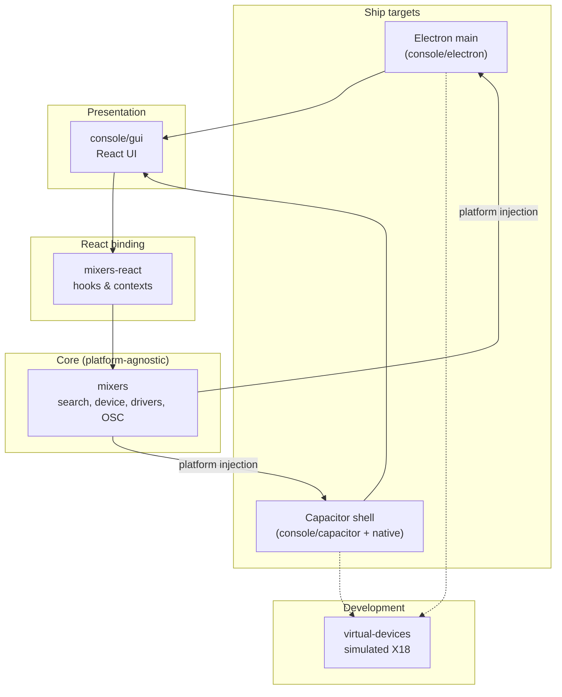

# Magical Mixing Console — Architecture & Layers

This document describes **code organization**: what each package owns, how they depend on each other, and where to make changes for common problems.

For mixer **domain vocabulary** (bus, input, output, etc.), see [CONCEPTS.md](./CONCEPTS.md).

---

## Stack at a glance

MMC is a monorepo. The app ships on **Electron** (desktop) and **Capacitor** (iOS/Android). Both run the same React UI and talk to mixers over **OSC/UDP**.



**Dependency rule:** upper layers import lower layers, never the reverse. `mixers` has no React dependency. `mixers-react` has no UI dependency. `console/gui` never implements OSC or UDP directly.

---

## Repository layout

| Path | Package / role |
|------|----------------|
| `src/mixers/` | `@magical-mixing/mixers` — core library (publishable, Apache-2.0) |
| `src/mixers-react/` | `@magical-mixing/mixers-react` — React hooks over mixers |
| `src/console/` | `@magical-mixing/console` — app (gui + platform adapters) |
| `src/virtual-devices/` | `@magical-mixing/virtual-devices` — simulated mixer for dev |
| `plugins/` | Custom Capacitor plugins (UDP socket, navigation bar) |
| `webpack/` | Build configs (Electron Forge, Capacitor bundle) |
| Root `package.json` | Workspace root, Electron/Capacitor scripts, shared deps |

---

## Layer responsibilities

### `@magical-mixing/mixers`

**What it is:** Platform-agnostic JavaScript library for discovering and controlling digital mixers.

**Owns:**
- Device search and connection lifecycle (`devices/search.js`, `devices/device.js`)
- OSC encode/decode helpers
- UDP controller abstraction (`controllers/udpOSC/`) — actual sockets come from outside
- LAN helpers (broadcast address from platform)
- **Drivers** per mixer family (`drivers/xair/`) — maps domain features to OSC paths and values
- Feature schema reference (`definition.json`)

**Does not own:**
- React, UI, routing, translations
- File system, settings persistence, vault storage
- Native UDP sockets (injected via `mixersInitialize(platform)`)

**Typical changes:**
- New or fixed OSC parameter for a supported desk
- New mixer model variant in an existing driver
- Search/discovery protocol fix
- Value conversion bug (dB, pan, enums)
- Support for a new mixer **driver** (large effort)

**Entry point:** `src/mixers/index.js` — exports `mixersInitialize`, `searchNew`, OSC helpers.

---

### `@magical-mixing/mixers-react`

**What it is:** Thin React binding over the mixers feature API.

**Owns:**
- `DeviceProvider` — connected device and its `features` tree
- Hooks per parameter (`useBusLevel`, `useInputGain`, …) — subscribe/get/set through driver API
- `ChangesProvider` — batching/applying multiple parameter writes
- `useSearch` — device discovery hook
- Scene-app capture logic exposed to UI

**Does not own:**
- Visual components, layout, styling
- OSC path strings (those live in drivers)
- Platform I/O

**Typical changes:**
- New hook for a driver feature already implemented in `mixers`
- Hook ergonomics (return shape, batch helpers)
- React subscription/lifecycle fix for a parameter
- Context provider behavior

**Rule of thumb:** if the driver already exposes `has/read/get/set` for a feature, add a hook here. If the feature does not exist in the driver, start in `mixers`.

**Entry point:** `src/mixers-react/index.js`.

---

### `@magical-mixing/console` → `gui/`

**What it is:** The product UI — React pages, components, routing, i18n, theming.

**Owns:**
- All screens and navigation (`gui/pages/`, `gui/routes/`)
- Reusable widgets (`gui/components/base/`)
- Layout shell (header, footer, breadcrumbs)
- Translations (`gui/components/language/`)
- App-only concepts UI: vault browser, app scenes, settings screens
- **Fallback** UI state for offline/demo DCA & mute group editing (`gui/components/fallback/`)

**Does not own:**
- OSC protocol, driver logic
- UDP, LAN, filesystem (calls platform + hooks only)

**Typical changes:**
- Navigation redesign, new screen, layout, styling
- Wiring an **existing** hook to a new control
- Copy, translations, accessibility
- Client-side UX (dialogs, pagination, responsive layout)

**Entry:** `gui/application.jsx` → `components/global/`.

See also: `.cursor/rules/console-gui.mdc`.

---

### `@magical-mixing/console` → `electron/` and `capacitor/`

**What they are:** **Platform adapters** — the same GUI runs everywhere; these modules implement the `platform` contract.

**Owns:**
- UDP socket open/send/receive (Electron main process or Capacitor plugin)
- LAN broadcast address discovery
- Persistent settings load/save
- Vault file storage
- OS integration: updates, language, haptics, status bar, navigation bar
- Virtual device run/stop (delegates to `virtual-devices`)

**Does not own:**
- Mixer protocol parsing (mixers)
- React components (gui)

**Typical changes:**
- Desktop vs mobile behavioral difference for I/O or storage
- Capacitor/Electron permission or lifecycle issue
- Auto-update, notarization-related **wiring** ([RELEASE.md](../release/RELEASE.md), [MACOS_SIGNING.md](../release/MACOS_SIGNING.md))

**Selection:** `gui/platform/index.js` loads `window.electron` or dynamically imports `capacitor/`.

---

### `@magical-mixing/virtual-devices`

**What it is:** Development tool — simulates an X18 responding to OSC so the app can run without hardware.

**Owns:**
- X18 state machine and OSC handlers (`x18/`)
- Capture/replay helpers for building test fixtures (`x18/capture/`)

**Does not own:**
- Production app behavior
- UI

**Typical changes:**
- Virtual desk missing OSC address the app now uses
- Local dev workflow without a physical mixer

**Entry:** `deviceRun('x18', { ip, port, platform })`.

---

### Root repo, `webpack/`, `plugins/`

**Root + webpack:** build pipeline — Electron Forge, Capacitor sync, bundling. Touch when adding deps, changing build targets, or fixing pack/release issues.

**`plugins/`:** native Capacitor plugins vendored in-repo (`capacitor-udp-socket`, `capacitor-navigation-bar`). Touch for mobile UDP or Android navigation bar behavior.

---

## Platform injection pattern

At startup (`gui/components/global/initialization.jsx`):

1. Load platform (`electron` or `capacitor`)
2. Wire settings and vault providers from platform
3. Call `mixersInitialize({ getLANBroadcastAddress, udpSocketOpen, … })`

The **same** `mixers` code runs on all targets; only the adapter changes. Never import Node `dgram` or Capacitor plugins from `mixers` or `mixers-react`.

---

## Driver structure (inside `mixers`)

For X Air desks, driver code lives under `src/mixers/drivers/xair/device/`:

```
device/
├── bus/          # per-bus features + send matrix (to/, from logic)
├── input/        # headamp / source definitions
├── output/       # physical outputs and routing sources
├── fx/           # effect processors
├── dca/ mg/      # group controls
├── automix/ scene/ configuration/
```

Each feature file implements a consistent API: `has`, `read`, `get`, `set` (and sometimes `options`, `minimum`, etc.) consumed by `mixers-react` hooks.

Bus **send matrix** drivers live under `bus/to/` (`on.js`, `level.js`, `tap.js`, …). Whether a route uses `on`, `level`, or both is type-pair specific. How MMC interprets those parameters in the UI (especially “in mix” for aux sends) is documented in **[CONCEPTS.md](./CONCEPTS.md)** → *Active sends (“in mix”)*.

---

## Where to fix what

| Problem | Start here |
|---------|------------|
| Wrong value sent to / read from mixer | `mixers/drivers/xair/…` |
| Parameter missing from API entirely | `mixers` driver, then hook in `mixers-react` |
| Hook exists but UI doesn't update | `mixers-react` hook/subscription |
| Layout, navigation, styling, copy | `console/gui` |
| New screen for existing parameter | `console/gui` only |
| UDP not working on iOS/Android | `console/capacitor`, `plugins/capacitor-udp-socket` |
| UDP not working on desktop | `console/electron/helpers/udp.js` |
| Settings or vault not persisting | `console/electron` or `console/capacitor` helpers |
| Dev without hardware | `virtual-devices` |
| Device not found on network | `mixers/devices/search.js`, driver search |
| Build / release / store packaging | root `package.json`, `webpack/`, [RELEASE.md](../release/RELEASE.md) |

---

## Change order for new mixer features

When adding control for something the desk supports but MMC does not:

1. **`mixers`** — driver: OSC path, read/write, `has` rules, options
2. **`mixers-react`** — hook(s) exposing it to React
3. **`console/gui`** — control on the appropriate page
4. **`virtual-devices`** — emulate OSC if you rely on virtual dev locally
5. **Translations** — if user-visible strings were added

Skip layers that don't apply (e.g. no GUI yet for a headless experiment).

---

## Publishing

`@magical-mixing/mixers` lives in `src/mixers/` and is linked via npm workspaces (see [DEVELOPMENT.md](../development/DEVELOPMENT.md#paquetes-npm-workspaces)). It can be published to npm independently ([RELEASE.md](../release/RELEASE.md) §7). Keep its public API stable; app-specific behavior belongs in `console`.

---

## Related docs

| Doc | Purpose |
|-----|---------|
| [CONCEPTS.md](./CONCEPTS.md) | Domain model for navigation & product |
| [CONNECTIVITY.md](./CONNECTIVITY.md) | Device search/connect actors, socket ownership, flows |
| [README.md](../README.md) | Doc index |
| [DEVELOPMENT.md](../development/DEVELOPMENT.md) | Dev setup, plugins, npm scripts |
| [RELEASE.md](../release/RELEASE.md) | Release manual (todas las plataformas) |
| [MACOS_SIGNING.md](../release/MACOS_SIGNING.md) | macOS Electron signing & notarization |
| [ASSETS.md](../release/ASSETS.md) | Icons & splash assets |
| [DEBUGGING_NETWORK.md](../development/DEBUGGING_NETWORK.md) | Wireshark / UDP debugging |
| [GUI.md](../gui/GUI.md) | GUI conventions |
| `.cursor/rules/console-gui.mdc` | Scoped rules for GUI-only work |
