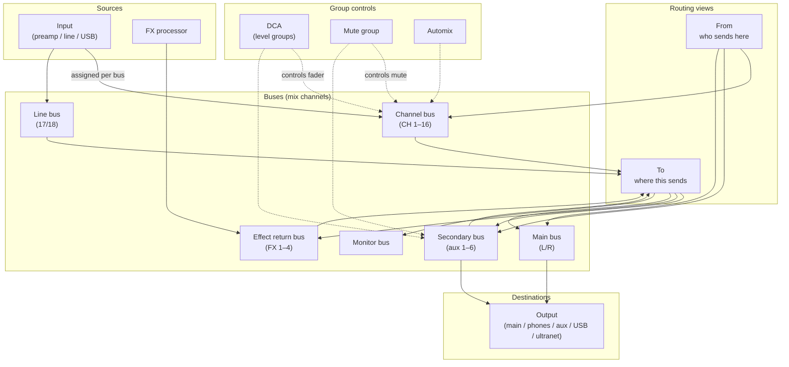

# Magical Mixing Console — Domain Concepts

This document describes the **mixer domain model** as Magical Mixing Console (MMC) understands it. It is meant for product and UI work — especially navigation — not for driver implementation details.

**Scope today:** Behringer X Air / M Air family (X18, XR18, MR18, XR16, MR12, and v2 variants). Concepts are expressed in **industry-standard English** (bus, channel, aux, DCA, etc.) regardless of UI locale.

---

## The big picture

A digital mixer takes **sources**, mixes them through **buses**, optionally processes them, routes them to other buses, and sends the result to **physical outputs**.

MMC exposes that model as separate **entities**. They are related, but not interchangeable:



**Key insight for navigation:** the app currently organizes screens mostly by **entity type** (Buses, Inputs, Outputs…). Users often think by **signal flow** (where does this come from / where does it go) or by **task** (mute the drums, check main sends). A new navigation model should bridge those mental models.

---

## Core concepts

### Bus

A **bus** is a mix channel — the primary working unit in MMC. Almost all mixing happens at the bus level: level, pan, mute, solo, EQ, gate, compressor, sends, inserts, etc.

Each bus has a **type**. On X18-class desks:

| Type | Role | Typical label |
|------|------|---------------|
| `channel` | Main input channel | CH 1–16 |
| `line` | Stereo line return | 17/18 |
| `effect` | Effect return (fed by an FX processor) | FX rtn 1–4 |
| `secondary` | Aux / submix bus | Bus 1–6 |
| `main` | Main L/R mix | Main |
| `monitor` | Solo / monitor path | Monitor |

Not every bus type supports every feature (e.g. gate and automix apply to `channel` buses; the main bus has different send rules than a channel).

**In MMC:** bus is the default landing screen after connect (`/` → main bus). Route: `/bus/:busId`, list: `/bus/list`.

---

### Input

An **input** is a **source** — a physical or logical input point on the desk (preamp socket, line in, USB channel), **not** the same thing as a bus.

- Inputs have their own settings: gain, trim, phantom power, etc.
- Which input feeds a given bus is configured **per bus** (input assignment on the bus screen).
- The input screen shows the reverse view: which buses are assigned to this input.

Input types include `preamp`, `line`, `usb`, and special values like `off`.

**Relationship:** many-to-many in practice, but usually one input → one channel bus, configured from either side.

**In MMC:** `/input/:inputId`, list: `/input/list`. Bus-side assignment: bus view → Input tab.

---

### Output

An **output** is a **physical destination** — where audio leaves the desk.

Output types on X18 include:

| Type | Meaning |
|------|---------|
| `main` | Main L/R out |
| `phones` | Headphone out |
| `analog` | Analog aux outs |
| `usb` | USB outputs |
| `ultranet` | P16 personal monitor outputs |

Each output has a **source** (which bus, FX return, or USB input feeds it) and a **level**.

**Relationship:** outputs are fed by buses (or other sources), not the other way around. The bus screen exposes a shortcut: “assign this bus as source on an output”.

**In MMC:** list only: `/output/list`. Bus-side shortcut: bus view → Outputs tab.

---

### FX (effects processor)

An **FX** unit is one of the desk’s internal effect processors (4 on X18). It has:

- A **type** (reverb, delay, etc.) with parameters
- An associated **effect return bus** (`effect` type) that carries the processed signal back into the mix
- Optional **insert** on channel/secondary buses

**Relationship:** FX processor ↔ effect return bus is 1:1. Effect returns can send to main, secondary buses, etc., like other buses.

**In MMC:** `/fx/:fxId`, list: `/fx/list`. Linked bus id is defined in the driver (`fxId` → `busId`).

---

### DCA (Digitally Controlled Amplifier)

A **DCA** is a **level group**. Assign buses to a DCA; moving the DCA fader moves all assigned bus faders together. A DCA does **not** mix audio — it remote-controls bus faders.

X18 has **4 DCAs**.

**In MMC:** `/dca/:dcaId`, list: `/dca/list`. On a bus, DCAs appear in the **From** view (alongside buses that send into the current bus).

---

### Mute group (MG)

A **mute group** mutes/unmutes multiple buses together. Unlike a DCA, it controls **mute state**, not level.

X18 has **4 mute groups**.

**In MMC:** `/mg/:mgId`, list: `/mg/list`. Buses can be assigned to mute groups from the bus screen.

---

### Automix

**Automix** is automatic gain riding for vocal/open-mic scenarios. On X Air desks it applies to **channel buses only**. There are two automix groups (X and Y on X18).

**In MMC:** `/automix/:automixId`, list: `/automix/list`. Per-bus automix assignment lives on the channel bus screen.

---

### Scene

A **scene** is a **snapshot** of mixer state (levels, routing, processing, etc.).

MMC distinguishes two storage locations:

| Kind | Where it lives | MMC route |
|------|----------------|-----------|
| **Device scene** | On the physical mixer (up to 64 slots) | `/scene/list/device` |
| **App scene** | Saved locally by MMC (vault) | `/scene/list/app` |

Device scenes are loaded/saved through the desk. App scenes capture device state into local storage and can be reapplied later.

---

### Vault

The **vault** is MMC’s **local preset/scene storage** — not part of the mixer hardware. Stored items include:

| Vault type | Contents |
|------------|----------|
| `scene` | App scenes |
| `preset-compressor` | Compressor presets |
| `preset-gate` | Gate presets |

**In MMC:** `/vault/list/:vaultType`, `/vault/:vaultId`.

Vault is an app concept: useful for navigation grouping under “Library” or “Presets”, separate from live mixing entities.

---

## Signal routing: From and To

The most important **relationship between buses** is the send matrix. MMC surfaces it on every bus screen as two mirror views:

### To (sends)

“What does **this bus** send to?”

- Channel, line, and effect buses can send to: **secondary**, **effect**, **main**, and **monitor** (with type-specific rules).
- Secondary buses can send to: **main** and **monitor**.
- Main bus can send to: **monitor** only.

Configured per destination: send on/off, level, pan, tap point, etc.

### Active sends (“in mix”)

MMC lists a send in **Sends** / **Reception** only when it is considered **in mix** — actively contributing (or ready to contribute) to the destination bus.

The X Air does **not** expose one universal “send on/off” for every route. MMC derives “in mix” from device parameters:

| Route kind | Device parameters | In mix when… |
|------------|-------------------|--------------|
| **Has `on`** (e.g. channel → main, channel → monitor, secondary → main/monitor) | Boolean switch (`/mix/lr`, `/-stat/solosw/…`, etc.) | `on === true` |
| **Level only** (e.g. channel → aux/effect) | Send level (min ≈ **−90 dB**), tap, sometimes `grpon` when tap = Same level | Send level is **above** the off threshold (see below) |

There is no separate MMC-side overlay state (no hidden Sets or pins). **Resets** that set level to device minimum or `on` to false therefore remove the send from the list, as long as the level stays at or below the threshold.

#### Level-only sends: off threshold and slider range

For routes without `on`, the desk still stores a send level at −90 dB when “off”; MMC treats that as inactive using a **1% band** of the level range (device min → max, typically **−90 dB → +10 dB**):

| Concept | Typical value (−90…+10) | Role |
|---------|---------------------------|------|
| Device minimum | −90 dB | Written on **−** remove and on reset — hardware “off” |
| Off/on threshold | −89 dB (min + 1% of range) | At or below → **not in mix**; above → **in mix** |
| Assignable minimum (slider floor) | −88 dB (min + 2% of range) | Lowest value the Sends slider allows while in mix |
| Default when enabling (+) | −88 dB (assignable minimum) | Send appears quietly; user raises level from there |

**UI rules (level-only):**

- **+ (Add)** sets level to the assignable minimum (not 0 dB).
- **− (Remove)** sets level to device minimum (−90 dB) and hides the row.
- The Sends level slider spans **assignable minimum → maximum**, not device minimum → maximum (linear mapping in that range).
- If another app raises a send above the threshold, MMC shows it as active — no special sync step.

Implementation: `console/gui/pages/bus/view/fromTo/busToLevelMix.js`, `useBusToInMix.jsx`, `fromTo/level.jsx`. Driver mapping: `mixers/drivers/xair/device/bus/to/on.js`, `level.js`.

### From (receives)

“What **sends into this bus**?”

Derived as the inverse of To: all buses that have an active send **to** the current bus. DCAs also appear here because they control buses contributing to the mix context.

**Navigation implication:** From/To are the natural “graph edges” of the mixer. A flow-based navigation could treat them as first-class links between bus instances, not buried tabs.

---

## Input ↔ Bus ↔ Output chain

Typical live sound path:

```
Microphone → Input (preamp) → Channel bus → … sends … → Main bus → Output (main L/R)
```

Secondary path example:

```
Playback USB → Input → Channel bus → send → Secondary bus 3 → Output (analog aux 3)
```

Effect path:

```
Channel bus → send → FX processor → Effect return bus → Main bus → Output
```

When designing navigation, these three hops (input assignment, bus sends, output source) are the same logical chain accessed from three different entity screens today.

---

## What each bus screen contains

The bus detail page (`/bus/:busId`) is the richest screen. Tabs vary by bus type and available features:

| Area | Purpose |
|------|---------|
| Strip | Name, icon, color, level, mute, solo, pan |
| Input | Source assignment, trim, linked input controls |
| From | Incoming sends + DCAs |
| To | Outgoing sends |
| Gate / EQ / Compressor | Processing (when supported) |
| FX / Insert | Effect routing |
| Monitor | Monitor tap options |
| Outputs | Quick output source assignment |
| DCA / MG | Group assignments |

The header **trail** shows the current entity label and instance (e.g. "CH 5" with picker) plus prev/next within the same entity type. Entity areas (Gate, From, Input, …) are **tabs in the sticky header**, not separate routes or inline tab bars below the trail.

---

## Current navigation map

How entities are reached today (header menu, ⋮):

```
Device
├── Settings / Disconnect / Reset / Search another device

Buses (grouped by type: main, channel, line, secondary, effect, monitor)
└── List

Groups
├── Mute groups
├── DCAs
└── Automix

Other
├── FXs
├── Inputs
├── Outputs
└── Scenes (device / app)

Footer area (app-level)
├── Vault / presets access
└── …
```

**Routes summary:**

| Entity | List route | Detail route |
|--------|------------|--------------|
| Bus | `/bus/list` | `/bus/:busId` |
| Input | `/input/list` | `/input/:inputId` |
| Output | `/output/list` | — |
| FX | `/fx/list` | `/fx/:fxId` |
| DCA | `/dca/list` | `/dca/:dcaId` |
| Mute group | `/mg/list` | `/mg/:mgId` |
| Automix | `/automix/list` | `/automix/:automixId` |
| Device scene | `/scene/list/device` | (inline actions) |
| App scene | `/scene/list/app` | (inline actions) |
| Vault | `/vault/list/:vaultType` | `/vault/:vaultId` |
| Connect | — | `/device/connect` |
| Settings | — | `/settings/device` |

---

## User tasks → concepts

| User intent | Concepts involved | Where today |
|-------------|-------------------|-------------|
| “Adjust the vocal channel” | Bus (channel) | `/bus/:id` |
| “Where is this mic patched?” | Input ↔ Bus assignment | Bus → Input, or Input → Buses |
| “Send keys to monitor aux” | Bus → To → secondary; Output source | Bus To + Output config |
| “Mute all drums” | Mute group, or multiple buses | MG, or bus list |
| “Ride the band bus fader” | DCA | `/dca/:id` |
| “More reverb on vocal” | FX, effect return, channel sends | FX + bus To/FX |
| “Save this mix” | Scene (device or app) | Scenes |
| “Recall yesterday’s show” | App scene or device scene | Scenes |
| “What feeds the main LR?” | From on main bus | Main bus → From |

---

## Terminology notes

- **Bus vs channel:** in MMC code, a “channel” is a bus of type `channel`. In UI copy, “channel” and “bus” may both appear; they refer to the same object unless explicitly about bus *type*.
- **Secondary vs aux:** `secondary` buses are aux/submix buses (Bus 1–6 on X18).
- **Line vs input:** the line **bus** (17/18) is a return channel; line **inputs** are source sockets feeding channel buses.
- **English as domain language:** mixer terminology is universally English in pro audio. UI translation (e.g. Spanish) translates labels but should not rename domain concepts (DCA, bus, FX, phantom, etc.).

---

## Open questions (for navigation redesign)

Fill in as product direction becomes clear:

- [ ] Primary navigation axis: **entity type** (today), **signal flow**, **task**, or hybrid?
- [ ] Should **bus remain the home screen**, or should “Mix” be an abstract view?
- [ ] Should **From/To** become cross-bus navigation (links) instead of tabs?
- [ ] Where do **Scenes** and **Vault** live — mixing workflow or separate “Library”?
- [ ] Should **Inputs** and **Outputs** be reachable mainly through buses, or stay top-level?

---

## Related code (for developers)

This doc intentionally avoids implementation. When code context is needed:

| Concept | Driver options | React hooks |
|---------|----------------|-------------|
| Bus types | `src/mixers/drivers/xair/device/bus/options.js` | `@magical-mixing/mixers-react` → `useBus*` |
| Inputs | `src/mixers/drivers/xair/device/input/options.js` | `useInput*` |
| Outputs | `src/mixers/drivers/xair/device/output/options.js` | `useOutput*` |
| Send matrix | `src/mixers/drivers/xair/device/bus/to/` | `useBusTo*`, `useBusFromOptions` |
| GUI routes | `src/console/gui/routes/` | — |
| GUI pages | `src/console/gui/pages/` | — |

When changing UI only, treat `mixers-react` hooks as a **read-only API contract** — do not modify lower layers unless a concept is missing from the model.
