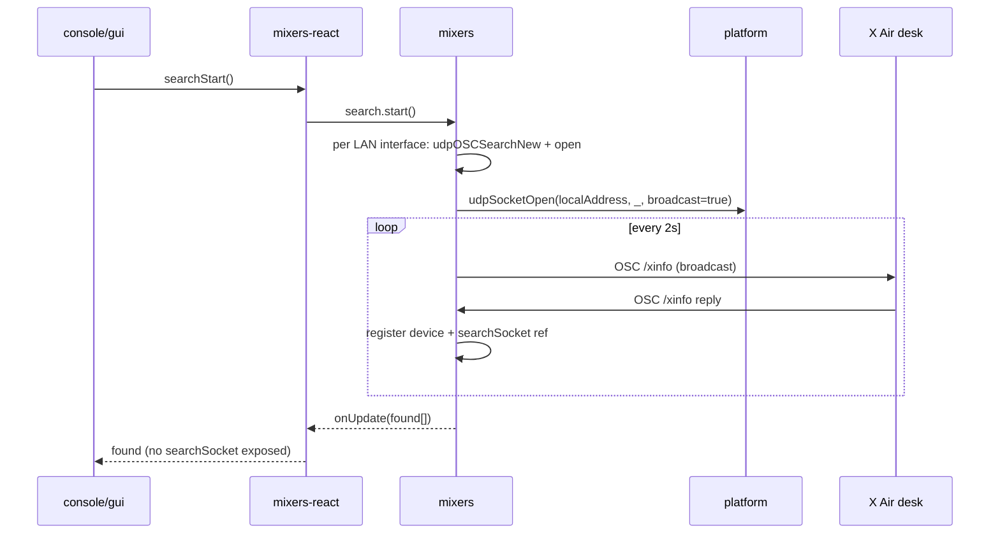
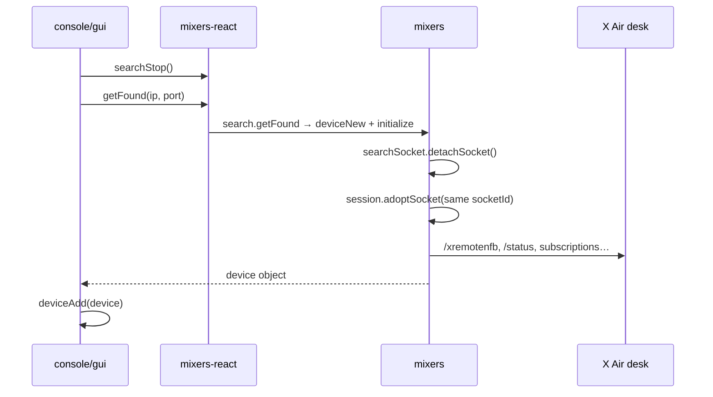

# Device connectivity — actors, responsibilities, and socket ownership

This document describes **who does what** when MMC discovers and connects to a mixer (today: Behringer X Air family over OSC/UDP). It complements [ARCHITECTURE.md](./ARCHITECTURE.md) (layer overview) and [CONCEPTS.md](./CONCEPTS.md) (mixer domain terms).

Use this doc when changing search, connect, pause/resume, or any network behaviour — so changes stay in the right layer.

---

## Actors at a glance

| Actor | Location | Knows about UDP/sockets? | Responsibility in connectivity |
|-------|----------|--------------------------|--------------------------------|
| **Platform** (Electron / Capacitor) | `console/electron/`, `console/capacitor/` | Yes — OS primitives only | Expose bind/send/receive/close; LAN interface enumeration |
| **mixers** | `src/mixers/` | Yes — full protocol & lifecycle | Search, connect, session, halt/resume; **owns all socket decisions** |
| **mixers-react** | `src/mixers-react/` | No | React hooks/context over mixers API (`useSearch`, `useDevice`) |
| **console/gui** | `console/gui/` | No | UX: “search”, “connect to result”, “connect to IP:port”, app device list |
| **virtual-devices** | `virtual-devices/` | Via same platform contract | Simulated desk for local dev (responds to OSC like hardware) |

**Dependency rule (unchanged):** GUI → mixers-react → mixers → platform injection. Upper layers never implement OSC or choose sockets.

---

## Layer responsibilities (connectivity)

### Platform — Electron / Capacitor

**Role:** Passthrough to the operating system. Implements a **transport contract**, not product logic.

**Owns:**
- Opening/closing a UDP socket (`udpSocketOpen`, `udpSocketClose`)
- Sending/receiving datagrams (`udpMessageSend`, `onUDPMessageReceived`)
- Enumerating LAN interfaces (`getLANInterfaces` / `getLANBroadcastAddress`, `getLocalAddressForIP`)
- App shutdown cleanup (e.g. close all OS sockets on quit)

**Does not own:**
- Whether a socket is for “search” or “session”
- When to reuse vs close a socket
- OSC encoding, X Air discovery protocol, device identity
- Connection state visible to the user

The platform may keep an internal `socketId → native socket` map. That is an **implementation detail of the primitive API** — opaque integer handles, not semantic roles.

**Typical touch points:** `console/electron/helpers/udp.js`, `console/electron/helpers/lan.js`, `console/capacitor/helpers/udp.js`, `console/capacitor/helpers/lan.js`.

#### Platform implementations

The **same contract** is implemented twice in-repo (plus native code on mobile):

| Target | Adapter | Native layer |
|--------|---------|--------------|
| **Desktop** | `console/electron/helpers/udp.js`, `lan.js` | Node.js `dgram` in Electron main process; IPC to renderer |
| **Mobile** | `console/capacitor/helpers/udp.js`, `lan.js` | [`plugins/capacitor-udp-socket`](../../plugins/capacitor-udp-socket) Capacitor plugin (iOS/Android) |

Capacitor’s `udp.js` wraps `UdpSocket` from the plugin — bind, send, receive, close — and maps to the same method names as Electron. Payloads cross the bridge as raw `bytes` arrays (0–255); no base64 in JS. Sends are not deferred with `setTimeout`. The plugin lives under `plugins/capacitor-udp-socket` (cloned at build time; see [DEVELOPMENT.md](../development/DEVELOPMENT.md)). It must stay as dumb as Electron: opaque socket handles, no search/session awareness.

GUI picks the adapter via `console/gui/platform/index.js` (`window.electron` → Electron API; otherwise dynamic import of `console/capacitor`).

---

### mixers — core library

**Role:** Single owner of **connectivity semantics**. Only layer that understands discovery, session, and protocol.

**Owns:**
- Device search lifecycle (`devices/search.js`)
- Connected device lifecycle (`devices/device.js`)
- UDP/OSC controller (`controllers/udpOSC/`) — wraps platform primitives into controllers
- Driver-specific discovery and session (`drivers/xair/search.js`, `drivers/xair/device/`)
- LAN strategy: which local address to bind, broadcast per interface, socket reuse
- Decisions: open, adopt, retarget listeners, close, halt without closing, resume on same socket

**Does not own:**
- React state or UI copy
- Native plugins directly (uses injected provider)

**Internal modules (connectivity):**

```
mixers/
├── helpers/lan.js              # LAN provider facade
├── controllers/udpOSC/
│   ├── udp.js                  # platform provider facade
│   ├── index.js                # search + session controllers, adopt/detach
│   └── osc.js                  # encode/decode
├── devices/
│   ├── search.js               # found-device registry, manual connect
│   └── device.js               # online/halted, initialize → driver
└── drivers/xair/
    ├── search.js               # /xinfo broadcast, attach searchSocket to found data
    └── device/index.js         # adopt search socket → session controller
```

---

### mixers-react

**Role:** Thin React binding. Forwards calls; adds subscription-friendly shapes.

**Owns:**
- `useSearch` — `searchStart`, `searchStop`, `searchInIPPort`, `getFound`, `found` list
- `useDevice` — `connect`, `halt`, `resume`, `dispose`, `isOnline`, `isHalted`

**Does not own:**
- UDP, sockets, OSC paths, or when to connect
- Any transport-specific logic

If connectivity behaviour changes, fix **mixers** first; only change mixers-react for hook ergonomics or React lifecycle.

---

### console/gui

**Role:** Product UX. Speaks in user intents, not transports.

**Owns:**
- Connect screen: list discovered desks, manual IP/port form
- When to start/stop search (e.g. page visible, app active, network online)
- App-level **device list** (`components/devices/context.jsx`) — which connected `device` objects are registered in the app and navigation after connect
- Pause UX when app loses focus (`AppActive` → `halt` / `resume` on device)

**Does not own:**
- Sockets, bind addresses, discovery packets, or session reuse rules

**Typical flow on connect screen:**
1. `searchStart()` — show discovered desks
2. User picks a desk → `searchStop()` → `getFound(ip, port)` → `deviceAdd(device)` → navigate

GUI never sees `searchSocket` or other internal fields; mixers strips them before updating the public found list.

#### App device list vs mixers search registry

These are **two different registries**. Do not conflate them.

| | mixers `search` | GUI `DevicesContext` |
|--|-----------------|----------------------|
| **Location** | `mixers/devices/search.js` | `console/gui/components/devices/context.jsx` |
| **Lifetime** | While search runs (and briefly for manual connect) | Whole app session |
| **Contents** | Desks **seen on the network** (metadata + internal `searchSocket`) | Desks **the user connected to** (live `device` objects from `getFound`) |
| **Purpose** | Discovery — populate the connect screen list | Product — header switcher, routing, which desk is focused |
| **Mutations** | Automatic on `/xinfo`; cleared on search stop | `deviceAdd` / `deviceRemove` from UI |

Flow when the user connects:

1. mixers `search` holds `{ ip, port, name, … }` for each discovered desk.
2. `getFound(ip, port)` builds a **session** `device` (socket adopted, driver initialized).
3. GUI calls `deviceAdd(device)` — the session object enters `DevicesContext`, not the search entry.
4. `deviceRemove` calls `device.dispose()` after a short delay — that is when mixers closes the session socket.

Search can list a desk the user never adds. The app list can hold multiple connected sessions (keyed by `deviceId`, today `ip:port`) while search is stopped. Header `focus` / `focused` is purely GUI state for which connected desk the UI shows.

---

### virtual-devices (development)

**Role:** Simulated X18 on the network. Uses the **same platform UDP contract** when run from Electron/Capacitor.

Not part of production connectivity path, but useful for local testing of search + connect without hardware.

---

## Socket ownership — the rule

> **mixers decides what each socket is for and when it lives or dies.**  
> **Platform only executes open / bind / send / receive / close on opaque handles.**

Concretely:

| Decision | Owner |
|----------|--------|
| Open socket for discovery on interface X | mixers (`drivers/xair/search.js` + `udpOSCSearchNew`) |
| Bind to local address for target IP | mixers (`openBoundSocket`, `getLocalAddressForIP`) |
| Reuse discovery socket for session | mixers (`detachSocket` → `adoptSocket` in xair device driver) |
| Close socket after connect vs keep for session | mixers |
| Halt app focus: stop processing but keep socket | mixers (`udpOSCController.halt` / `device.halt`) |
| Close on device dispose | mixers → calls platform `udpSocketClose` |
| Map `socketId` to native `dgram` socket | platform only |

Electron and Capacitor must **not** branch on “search vs connection”. If that distinction appears in platform code, it belongs higher in mixers.

---

## Platform contract (injected at startup)

### Bootstrap wiring (`initialization.jsx`)

`console/gui/components/global/initialization.jsx` is **not** a connectivity layer. It runs once at app boot and wires dependencies:

1. `platformLoad()` — Electron preload API or Capacitor module
2. Settings and vault providers (unrelated to mixers)
3. `mixersInitialize({ … })` — passes platform UDP/LAN functions into mixers

It does not decide when to search, connect, or reuse sockets. If mixers needs a new platform capability, add it to **both** Electron and Capacitor adapters, expose it on the platform object, and register it here. Business logic stays in mixers.

| Method | Purpose |
|--------|---------|
| `getLANBroadcastAddress` / `getLANInterfaces` | List `{ localAddress, broadcastAddress, interfaceName }` |
| `getLocalAddressForIP(targetIp)` | Local IP on the subnet that can reach the desk |
| `udpSocketOpen(bindAddress, port, enableBroadcast)` | Create + bind socket; returns opaque `socketId` |
| `udpSocketClose(socketId)` | Close and drop handle |
| `udpMessageSend(socketId, address, port, message)` | Send datagram |
| `onUDPMessageReceived(callback, socketId)` | Subscribe; returns unsubscribe function |

mixers wraps these in `controllers/udpOSC/udp.js` and never imports Node `dgram` or Capacitor plugins directly.

---

## End-to-end flows

### 1. Broadcast search



### 2. Connect from search result



**Why reuse the search socket:** the desk often associates OSC traffic with the **same local IP and ephemeral port** that answered discovery. Opening a new socket after search can silently fail until rediscovery.

### 3. Manual connect (IP + port)

Same ownership rules. mixers:
1. Clears stale cache entry for that `ip:port`
2. Starts targeted search (`searchInIPPortStart`)
3. Waits for a **live** `searchSocket` (fresh `/xinfo` response), not cached metadata alone
4. Then same handoff as connect-from-list

GUI only calls `searchInIPPort(ip, port, onFound, onNotFound)`.

### 4. App paused (focus loss)

```mermaid
sequenceDiagram
    participant GUI as console/gui
    participant MR as mixers-react
    participant M as mixers

    GUI->>MR: device.halt() via AppActive
    MR->>M: device.halt()
    M->>M: _halted=true, stop keepalive/subscriptions
    Note over M: socket stays open; inbound ignored
    GUI->>GUI: header shows "Paused" (isHalted)
```

On resume, mixers re-enables processing and renews subscriptions **on the same socket** — no reconnect from platform.

---

## What each layer exposes (abstract API)

### GUI / user intent

- “Start looking for desks”
- “Stop looking”
- “Connect to this desk” (from list or IP:port)
- “Pause control while app in background”

### mixers-react

- `useSearch`: `{ found, searchStart, searchStop, searchInIPPort, getFound }`
- `useDevice`: `{ connect, halt, resume, dispose, isOnline, isHalted, … }`

### mixers (conceptual)

- `searchNew()` — registry of discovered desks
- `device` — one connected desk session with `features` tree
- Internal: `searchSocket`, `localAddress`, `udpOSCSearchNew`, `udpOSCControllerNew`

---

## States worth distinguishing

| State | Layer | Meaning |
|-------|-------|---------|
| **Searching** | mixers `search` | Broadcasting / waiting for `/xinfo` |
| **Found (listed)** | mixers `search` | Desk seen; may still be searching |
| **Connected (session)** | mixers `device` | Socket adopted; OSC subscriptions active |
| **Halted** | mixers `device` | Paused; socket open, traffic ignored |
| **Offline** | mixers `device` | No keepalive from desk (TTL expired) |
| **In app list** | console/gui `devices` context | User added device to running app |

“Paused” ≠ “Reconnecting”. Halted keeps the session socket; offline is loss of desk response.

---

## Where to change what

| Problem | Start here |
|---------|------------|
| Desk not found on LAN | `mixers/drivers/xair/search.js`, `mixers/devices/search.js`, `mixers/helpers/lan.js` |
| Found but connect fails / no OSC | `mixers/drivers/xair/device/index.js`, `mixers/controllers/udpOSC/index.js` (adopt/reuse) |
| Wrong interface / bind | `mixers/helpers/lan.js` + platform `lan.js` |
| Bind/send fails on desktop/mobile | platform `udp.js` (primitive), not GUI |
| Connect button / search UX | `console/gui/pages/device/connect.jsx` |
| Hook missing or stale React state | `mixers-react/search.jsx` or `device/index.jsx` |
| Local dev without hardware | `virtual-devices` |

---

## Invariants (keep these when extending connectivity)

1. **Platform stays dumb** — no search/session semantics in Electron/Capacitor.
2. **mixers owns socket lifecycle** — including reuse from discovery to session.
3. **GUI and mixers-react stay transport-agnostic** — no UDP types in UI code.
4. **Internal fields stay internal** — e.g. `searchSocket` never leaks to `found[]` for React.
5. **Drivers own protocol** — X Air `/xinfo` discovery lives in `drivers/xair/`; another desk family would add another driver, same mixers device/search shell.
6. **Provider injection only** — `mixers` runs the same on Electron and Capacitor; swap adapter, not core logic.

---

## Related docs

| Doc | Purpose |
|-----|---------|
| [ARCHITECTURE.md](./ARCHITECTURE.md) | Full layer map and “where to fix what” |
| [CONCEPTS.md](./CONCEPTS.md) | Bus, input, scene, etc. |
| [GUI.md](../gui/GUI.md) | React performance patterns for subscribed controls |
